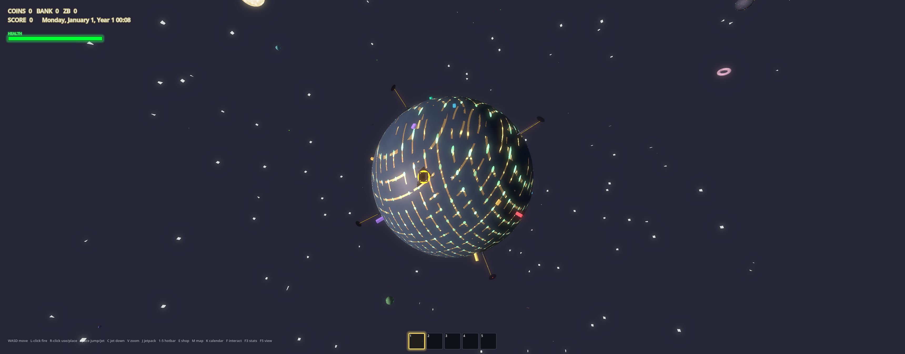
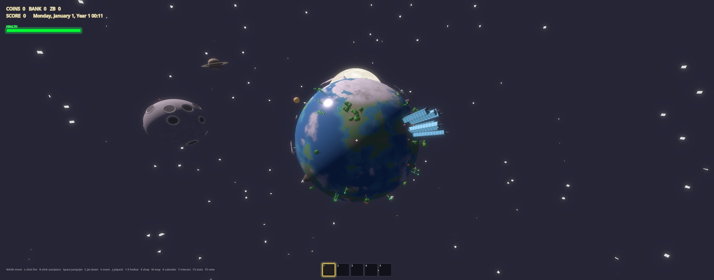
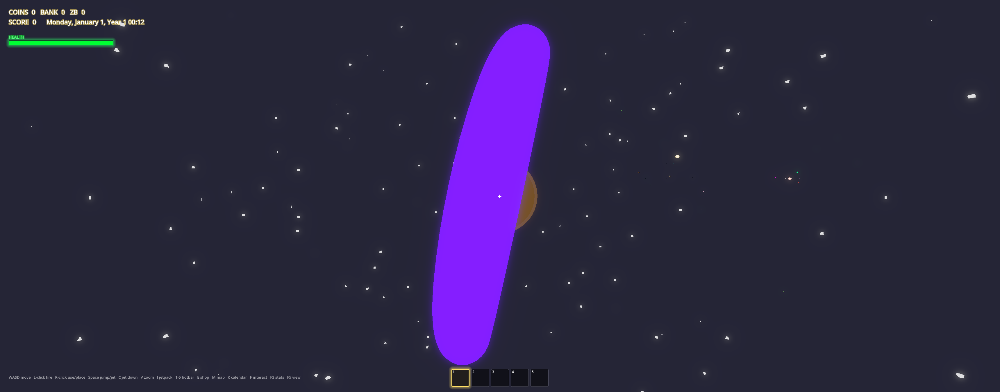
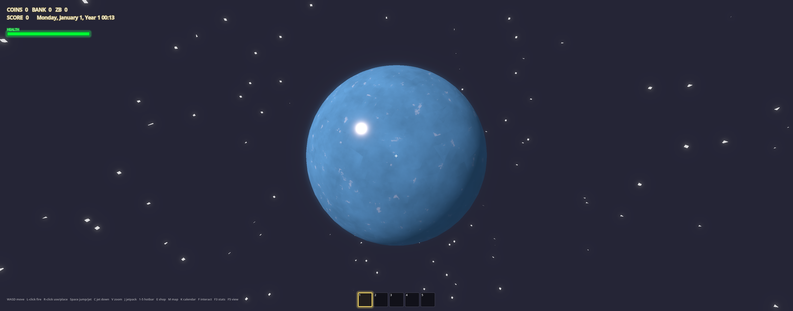
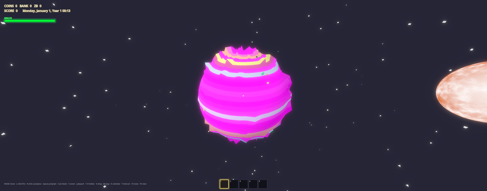
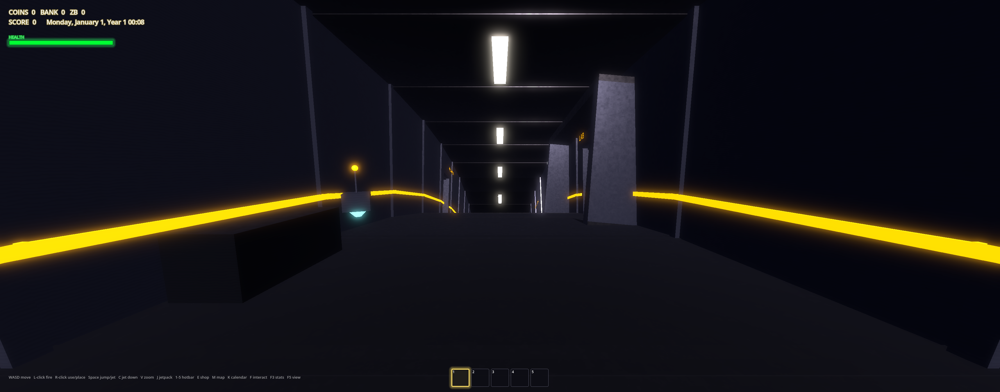
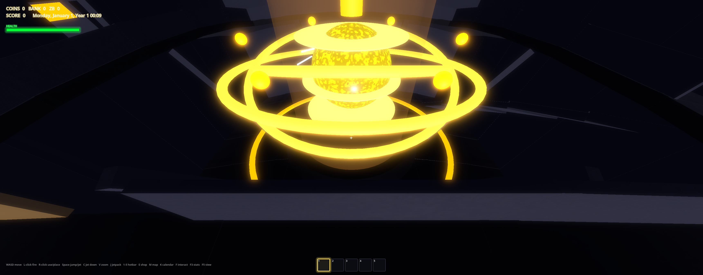
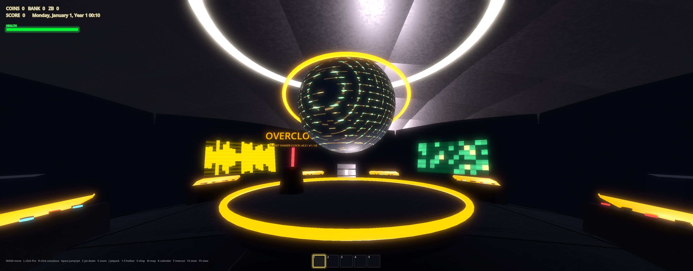

# CLAUDE THE DUDE

A handmade 3D universe in Godot 4.6: real Newtonian-ish gravity, dozens of planets you can land on and dig into, machines and wiring, LAN multiplayer, gods, monoliths, and one motherboard planet run by an A.I. that has kept the lights on for four hundred years.



## The universe

Every world is a real body with its own gravity — walk it, orbit it, tunnel inside it. Some highlights:

| System | Worlds |
| --- | --- |
| Home / Dude system | Home, Circuitia, Logica, Pi, **Big Computer** (the motherboard planet), Euclid, Donut (a torus you can walk all the way around), Verdant, Crystalia |
| Shader system | Contrast, Pixel, Datamosh, Wireframe + Blind, Wobble — every one skinned by its own shader, three with icosahedron colonies INSIDE them |
| Sol | Yes, that one: Mercury → Neptune, Earth with trees and small talkative humans, gas giants that are all fog inside and will crush you |
| Tris | Sanus (lava), Extroma (volcanic), Varnisol (pines and lakes), Xero (ice moon), **Big Water** (an ocean with no land at all — sink to the sand floor) |
| Elsewhere | TIN 618, a black hole that broadcasts radio and eats the unwary; Harold, the tired rock beside it; and at least one wanderer that appears on no map |






## BIG COMPUTER

The dudes' control planet — a motherboard in space, hollow, and fully built inside. Two great-circle hallway rings wrap the entire interior and cross at the atrium and at the antipode cockpit. Inside: a curved CONTROL DECK that visibly bends with gravity, a reactor cavern 24 meters floor-to-ceiling with a glass control booth, two server farms with eight blinking lights per rack, a lab complex holding SPECIMEN 4, a grand aquarium (whale, manta, anglerfish, jellyfish, a school of silver fish), a giant starship-bridge PLANET CONTROL room, bunks, a gold VIP deck, a kitchen, a trophy hall, an interuniverse radio, elevators down to the DATA VAULT, the UNDERCROFT ring level, and a glass viewing ring around the planet's molten core. Below and between everything: a secret walk-in ventilation web and a hidden computer-tunnel network with four unmarked entrances, checkpoints, and a noodle bowl at the very bottom. Two glowing airlocks open into the hollow (jetpack required). The DUDE A.I. answers at its terminal, one line at a time.





## The monolith chain

On Harold stands a stele nobody carved, with a tetrahedral socket and pictograms that reflect what they point at. Feed it the Yellow Tetrahedron (the lab on Big Computer knows where one is) and the sky fills with turning triangles, the stone sinks into the ground, and somewhere on Earth something buried begins to rise. Eight monoliths, eight colors, eight worlds — the tracker above your inventory keeps score.

## Systems, briefly

- **Machines + power**: generators, coal drills, bioreactors, RTGs, capacitors that report EU/s, electric furnaces, sell stations, teleporter warp pads, logic coils, wires and item funnels. Placement is honest: no rockets or machines inside planets.
- **Progression**: ores → ingots → iridium → ultima; temples with real puzzles (a terminal, a blind maze, a boolean lock); a shadow realm; a permadeath apple with a full cinematic; an infinite shrinking Menger pyramid.
- **Multiplayer**: LAN with discovery — chat, synced building, shared monolith progress, friendly fire, riding other people's rockets.
- **Radio**: a dish you aim at the sky. Every world broadcasts something; the black hole broadcasts whether you like it or not; BIG COMPUTER FM plays circuits.
- **The gods**: a noodle deity that watches, wrath, stalkers that keep their distance while you stare, and a fork that is coming.

## Running it

Godot 4.6.2+. Open the project and run — or standalone:

```
godot --path <project dir>
```

Loading has a real progress bar. Saves are per-slot, machines and world edits persist, and the black hole keeps whatever it catches.
